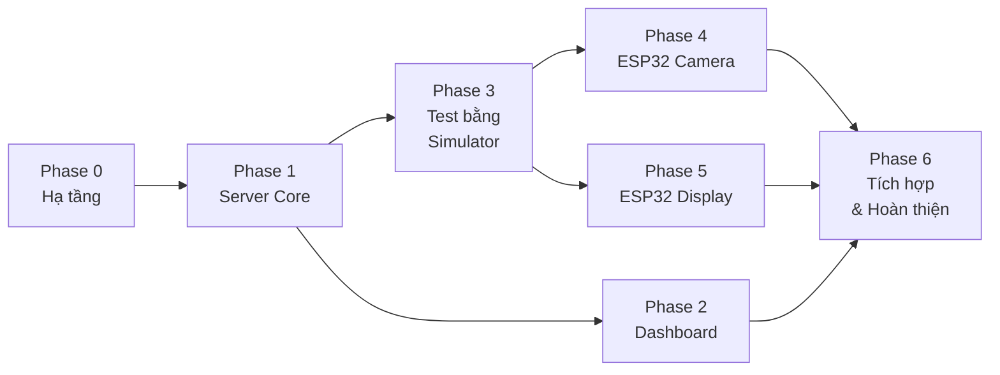

# 📊 IoT Camera System — Task & Tiến Độ Tổng Thể

> **Mục tiêu cuối cùng:** ESP32 chụp ảnh từ OV7670 → gửi lên Web Server qua WiFi → Dashboard hiển thị real-time → Display Node (TFT) tải và hiển thị ảnh. Toàn bộ điều khiển qua MQTT.
>
> **Ngày bắt đầu:** 2026-02-25
> **Cap nhat lan cuoi:** 2026-02-27 17:20

---

## Sơ Đồ Phụ Thuộc Giữa Các Giai Đoạn



> **Đọc sơ đồ:** Phase 0 → 1 → 3 là đường chính. Phase 2 (Dashboard đẹp) có thể làm song song với Phase 3. Phase 4 và 5 (ESP32) làm sau khi Simulator đã test OK.

---

## PHASE 0 — HẠ TẦNG CĂN BẢN ✅ HOÀN THÀNH
> *Mục tiêu: Cài xong tất cả công cụ, sẵn sàng code.*

- [x] Cài đặt Python + Flask + chạy được `app.py` cơ bản
- [x] Cài thư viện bổ sung (`flask-socketio`, `paho-mqtt`, `flask-cors`, `eventlet`)
- [x] Cài đặt **Mosquitto MQTT Broker** trên PC
  - [x] Tải từ [mosquitto.org/download](https://mosquitto.org/download/)
  - [x] Cài đặt và chạy service Mosquitto
  - [x] Test nhanh: dùng `mosquitto_pub` và `mosquitto_sub` gửi/nhận tin nhắn thử
- [x] Xóa database cũ (`database.db`) và chuẩn bị migrate schema mới
- [x] Cập nhật `requirements.txt` với đầy đủ thư viện

📝 **Ghi chú báo cáo Phase 0:**
1. **Cài Mosquitto:** Tải installer từ mosquitto.org, cài đặt mặc định, service tự chạy ngầm (Windows Service).
2. **Test MQTT Broker:** Bật 2 cửa sổ PowerShell. Cửa sổ 1 chạy lệnh subscribe:
   ```powershell
   & "C:\Program Files\mosquitto\mosquitto_sub" -t "test"
   ```
   Cửa sổ 2 chạy lệnh publish:
   ```powershell
   & "C:\Program Files\mosquitto\mosquitto_pub" -t "test" -m "hello"
   ```
   Kết quả: Cửa sổ 1 hiện chữ "hello" → Broker hoạt động thông suốt.
   > **Lưu ý:** Trên PowerShell phải dùng toán tử `&` trước đường dẫn có dấu cách. Nếu dùng CMD thì dùng dấu ngoặc kép bình thường.
3. **Cài thư viện Python:** `pip install flask flask-socketio paho-mqtt flask-cors eventlet Pillow`
4. **Xóa DB cũ:** `Remove-Item "database.db" -Force` trong PowerShell.
5. **Tạo `requirements.txt`:** Liệt kê tất cả dependency kèm version cụ thể.

**✅ Milestone: HOÀN THÀNH** — Mosquitto chạy OK, tất cả thư viện đã cài, DB cũ đã xóa.

---

## PHASE 1 — NÂNG CẤP SERVER CORE (`app.py`) ✅ HOÀN THÀNH
> *Mục tiêu: Server biết nói chuyện qua cả 3 giao thức (HTTP + MQTT + WebSocket).*

### 1A. Database Schema Mới
- [x] Tạo bảng `images` (nâng cấp: thêm cột `device_id`, `resolution`)
- [x] Tạo bảng `commands` (lưu lệnh điều khiển + trạng thái ACK)
- [x] Tạo bảng `devices` (quản lý thiết bị online/offline)
- [x] Tạo bảng `event_logs` (log sự kiện từ các thiết bị)
- [x] Tạo các index cho truy vấn nhanh

### 1B. Tích Hợp MQTT Client Vào Flask
- [x] Kết nối Flask → Mosquitto Broker (`paho-mqtt`)
- [x] Subscribe các topic: `iot/camera/ack`, `iot/camera/status`, `iot/system/heartbeat`, `iot/system/log`
- [x] Xử lý message nhận được → lưu vào DB + forward qua WebSocket

### 1C. Tích Hợp WebSocket (Flask-SocketIO)
- [x] Khởi tạo SocketIO với Flask
- [x] Emit event `new_image` khi có ảnh mới upload
- [x] Emit event `device_update` khi nhận heartbeat
- [x] Emit event `command_result` khi nhận ACK từ camera
- [x] Xử lý event `send_command` từ browser → publish lên MQTT

### 1D. API Endpoints Mới
- [x] `POST /api/upload` — nâng cấp: thêm `device_id`, phát MQTT notify + WebSocket emit
- [x] `GET /api/images` — danh sách ảnh có phân trang (pagination)
- [x] `GET /api/images/<id>` — chi tiết 1 ảnh
- [x] `DELETE /api/images/<id>` — xóa ảnh
- [x] `GET /api/status` — trạng thái toàn hệ thống (devices, uptime, storage)
- [x] `GET /api/latest?format=json` — hỗ trợ trả metadata JSON

### 1E. Heartbeat Monitor (Phát Hiện Offline)
- [x] Background thread kiểm tra `last_seen` của mỗi device
- [x] Nếu > 90 giây không có heartbeat → đánh dấu `offline`
- [x] Gửi WebSocket `device_update` khi trạng thái thay đổi

📝 **Ghi chú báo cáo Phase 1:**
1. **Viết lại hoàn toàn `app.py`** từ ~95 dòng (v1.0) lên ~760 dòng (v2.0). File này giờ đóng vai trò "bộ não" trung tâm của hệ thống.
2. **Database Schema:** Hàm `init_db()` tạo 4 bảng SQLite:
   - `images`: id, filename, file_size, device_id, resolution, timestamp
   - `commands`: id, cmd_id, target_device, command, params, status, ack_at, ack_message
   - `devices`: device_id (PK), device_type, ip_address, status, last_seen, wifi_rssi, free_heap
   - `event_logs`: id, device_id, level, event, message, timestamp
   - 3 index: idx_images_timestamp, idx_commands_status, idx_logs_timestamp
   - Dùng `ON CONFLICT(device_id) DO UPDATE` cho upsert thiết bị.
3. **MQTT Client:** Dùng `paho.mqtt.client` (CallbackAPIVersion.VERSION2). Gọi `mqtt_client.loop_start()` để MQTT loop chạy non-blocking trong thread riêng. Hàm `on_mqtt_message()` parse JSON payload rồi phân loại xử lý theo topic:
   - `iot/system/heartbeat` → cập nhật `device_status_cache` (dict RAM) + INSERT/UPDATE DB + emit WebSocket
   - `iot/camera/ack` → UPDATE bảng commands + emit WS `command_result`
   - `iot/system/log` → INSERT vào event_logs + emit WS `log_entry`
4. **WebSocket:** Dùng `Flask-SocketIO` async_mode `eventlet`. Khi browser connect → server emit `system_status` chứa trạng thái tất cả thiết bị. Event `send_command` từ browser → tạo `cmd_id` duy nhất (UUID) → lưu DB → publish lên MQTT topic `iot/camera/cmd`.
5. **API Upload Flow:** Khi nhận ảnh qua HTTP POST:
   - Bước 1: Lưu file vào thư mục `uploads/`, ghi metadata vào bảng `images`
   - Bước 2: Publish MQTT message lên `iot/notify/new_image` (QoS 1)
   - Bước 3: Emit WebSocket event `new_image` cho Dashboard
6. **Heartbeat Monitor:** Chạy dạng `socketio.start_background_task()`, kiểm tra mỗi 15 giây. So sánh `datetime.now()` với `last_seen`, nếu chênh lệch > 90s → set status = 'offline' + emit WS.
7. **Fix lỗi Unicode Windows:** Thêm `sys.stdout.reconfigure(encoding='utf-8')` ở đầu file vì máy Windows dùng codepage CP1258 không hỗ trợ emoji.
8. **Test:** Chạy `python app.py` → server listen port 5000 → gửi heartbeat giả lập bằng Python paho-mqtt → API `/api/status` trả JSON chứa thiết bị `CAM_NODE_01` đúng chuẩn.

**✅ Milestone: HOÀN THÀNH**

---

## PHASE 2 — DASHBOARD FRONTEND (`index.html`) ✅ HOÀN THÀNH
> *Mục tiêu: Dashboard đẹp, cập nhật real-time không cần F5.*

### 2A. Kết Nối WebSocket Phía Client
- [x] Thêm thư viện `socket.io.js` vào HTML
- [x] Kết nối WebSocket tới Flask Server
- [x] Lắng nghe event `new_image` → tự động thêm ảnh mới vào gallery
- [x] Lắng nghe event `device_update` → cập nhật trạng thái thiết bị

### 2B. Panel Trạng Thái Thiết Bị
- [x] Hiển thị danh sách thiết bị (Camera Node, Display Node)
- [x] Mỗi thiết bị: tên, IP, trạng thái (🟢 Online / 🔴 Offline), RSSI WiFi, last seen
- [x] Cập nhật real-time qua WebSocket (không cần refresh)

### 2C. Nút Điều Khiển Hoạt Động Thật
- [x] Nút "Chụp ảnh ngay" → gửi WebSocket `send_command` → MQTT → Camera
- [x] Nút "Bật/Tắt Stream" → toggle trạng thái
- [x] Nút "Khởi động lại" → gửi lệnh RESTART
- [x] Hiển thị trạng thái lệnh (PENDING → OK / ERROR)

### 2D. Gallery Ảnh Cải Tiến
- [x] Nút xóa ảnh (DELETE API + fadeOut animation)
- [x] Hiển thị thông tin: device, timestamp
- [x] Fix lỗi ảnh broken icon (SVG placeholder onerror)
- [ ] Phân trang — để Phase 6

### 2E. Log Viewer
- [x] Panel hiển thị log real-time từ các thiết bị
- [x] Hiển thị theo mức: INFO / WARNING / ERROR (color-coded badges)
- [x] Auto-scroll xuống dòng mới nhất

### 2F. Giao Diện Đẹp & Responsive
- [x] Dark mode (mặc định)
- [x] Responsive cho mobile (CSS Grid collapse < 1024px)
- [x] Micro-animations (fadeIn, translateY khi ảnh mới)
- [x] Toast notification (success/error/info, auto-dismiss 3s)

📝 **Ghi chú báo cáo Phase 2:**
1. **Viết lại hoàn toàn `index.html`** từ ~198 dòng (v1.0) lên ~1120 dòng (v2.0).
2. **WebSocket Client:** Load `socket.io.js` v4.7.4 từ CDN (`cdnjs.cloudflare.com`). Kết nối tới Flask qua `io(SERVER_URL)` với `SERVER_URL = 'http://' + hostname + ':5000'`. Khi connect thành công → emit `request_status` để lấy danh sách thiết bị.
3. **Các WS Event Handler:**
   - `system_status` → cập nhật toàn bộ panel thiết bị + server uptime
   - `new_image` → gọi `addImageToGallery()` chèn card ảnh mới vào đầu gallery (không cần F5)
   - `device_update` → gọi `updateSingleDevice()` cập nhật sidebar
   - `command_sent` → log vào Event Log
   - `command_result` → reset trạng thái nút + hiện toast
4. **Panel Thiết Bị:** Sidebar trái hiện danh sách device cards. Mỗi card có icon (camera/display), tên device_id, IP, RSSI dBm, status dot (xanh=online, xám=offline). Dùng hàm `updateDeviceList()` render HTML động.
5. **Nút Điều Khiển:** 3 nút: "Chup Anh Ngay" (primary blue), "Bat Stream" (toggle), "Khoi Dong Lai Node" (danger red). Nút Capture khi click → thêm class `loading` hiện CSS spinner → emit WS `send_command` → server publish MQTT `iot/camera/cmd`. Auto-reset sau 10s nếu không nhận ACK.
6. **Gallery:** Mỗi image card gồm thumbnail, filename, timestamp, device_id, nút xóa (✕). Dùng `data-image-id` attribute + event delegation thay vì inline `onclick` (tránh lỗi lint Jinja2). Ảnh lỗi tự thay bằng SVG placeholder "No Image".
7. **Event Log:** Panel sidebar, font monospace, mỗi entry có timestamp + badge level (INFO xanh, WARNING vàng, ERROR đỏ) + message. Max 100 entries, auto-scroll, có nút Clear.
8. **Toast Notifications:** Popup góc dưới phải, 3 loại (success xanh, error đỏ, info xanh dương), auto-dismiss sau 3 giây với animation slide-in/fade-out.
9. **Design System:** CSS custom properties (15+ biến màu), font Inter từ Google Fonts, responsive grid (2 cột → 1 cột dưới 1024px). Hiệu ứng hover glow trên panels, micro-animations fadeIn cho ảnh mới.
10. **Fix lỗi quan trọng:**
    - Thêm `SERVER_URL` constant để mọi API call/WebSocket đều trỏ đúng port 5000 (tránh lỗi khi mở qua VS Code Live Server port 5500).
    - Thêm cảnh báo đỏ nếu mở file sai cách (không qua Flask).
    - Thêm `background-clip: text` cho CSS compatibility.
    - Đổi inline `onclick` Jinja2 sang `data-` attribute + event delegation.

**✅ Milestone: HOÀN THÀNH** — Dashboard dark theme, real-time WebSocket, 2 thiết bị Online.

---

## PHASE 3 — TEST BẰNG SIMULATOR (KHÔNG CẦN PHẦN CỨNG) ✅ HOÀN THÀNH
> *Mục tiêu: Test toàn bộ luồng giao thức bằng code Python giả lập ESP32.*

### 3A. Simulator Camera Node (Python)
- [x] Script `sim_camera.py`: kết nối MQTT Broker
- [x] Subscribe topic `iot/camera/cmd`
- [x] Nhận lệnh CAPTURE → tạo ảnh gradient bằng Pillow → HTTP POST `/api/upload`
- [x] Gửi heartbeat mỗi 30 giây lên `iot/system/heartbeat`
- [x] Gửi ACK sau khi nhận lệnh lên `iot/camera/ack`

### 3B. Simulator Display Node (Python)
- [x] Script `sim_display.py`: kết nối MQTT
- [x] Subscribe topic `iot/notify/new_image`
- [x] Khi nhận thông báo → HTTP GET tải ảnh → lưu vào `downloaded_images/`
- [x] Gửi heartbeat mỗi 30 giây

### 3C. Test Toàn Bộ Luồng
- [x] **Luong 1 — Ra lenh chup:** Gui MQTT `iot/camera/cmd` → Sim Camera nhan → Tao anh → Upload → Dashboard hien anh moi + Sim Display nhan thong bao
- [x] **Luong 2 — Heartbeat:** Sim Camera + Sim Display gui heartbeat → Dashboard hien 2 thiet bi Online
- [x] **Luong 3 — Offline Detection:** Tat ca Simulator → doi 100s → API `/api/status` tra ve `status: "offline"` cho ca 2 thiet bi → Dashboard hien dot xam
- [x] **Luong 4 — Error Recovery:** Khoi dong lai sim_camera sau khi offline → gui heartbeat moi → CAM_NODE_01 tu dong chuyen ve `online`, DISP_NODE_01 van `offline` (dung expected)

📝 **Ghi chu bao cao Phase 3:**
1. **`sim_camera.py` (~260 dong):** Gia lap ESP32 Camera Node hoan chinh.
   - Ket noi MQTT Broker tai `127.0.0.1:1883` voi client_id `sim_CAM_NODE_01`
   - Subscribe topic `iot/camera/cmd` (QoS 1)
   - Khi nhan lenh CAPTURE: dung `Pillow` tao anh gradient ngau nhien 160×120 RGB → encode JPEG → HTTP POST multipart len `http://127.0.0.1:5000/api/upload` kem `device_id=CAM_NODE_01` va `resolution=160x120`
   - Gui ACK len `iot/camera/ack` sau khi xu ly (status OK/ERROR + message)
   - Ho tro lenh: CAPTURE, STREAM_ON, STREAM_OFF, RESTART, CONFIG
   - Stream mode: thread rieng chup lien tuc theo interval
   - Heartbeat thread: gui JSON moi 30s gom device_id, device_type, ip_address, wifi_rssi (random), free_heap (random)
2. **`sim_display.py` (~230 dong):** Gia lap ESP32 Display Node.
   - Subscribe `iot/notify/new_image` (QoS 1)
   - Khi nhan thong bao anh moi: parse URL tu payload → HTTP GET tai anh → luu vao thu muc `downloaded_images/` → validate bang Pillow (kiem tra kich thuoc, format)
   - Subscribe `iot/system/heartbeat` de theo doi trang thai thiet bi khac
   - Khi khoi dong: tu dong tai anh moi nhat tu `GET /api/latest?format=json`
3. **Ket qua test tich hop (Luong 1+2):**
   - Chay 3 process dong thoi: `python app.py` + `python sim_camera.py` + `python sim_display.py`
   - Gui lenh CAPTURE qua MQTT → Sim Camera nhan → tao anh gradient → upload thanh cong → Dashboard hien anh real-time + Sim Display nhan thong bao + tai anh
   - API `/api/status` tra ve: CAM_NODE_01 (online, RSSI -58dBm, uploads: 1) + DISP_NODE_01 (online, RSSI -48dBm)
4. **Ket qua test Offline Detection (Luong 3):**
   - Tat tat ca process sim_camera va sim_display
   - Doi 100 giay (vuot heartbeat timeout 90s)
   - API `/api/status`: ca CAM_NODE_01 va DISP_NODE_01 deu tra ve `status: "offline"`
   - Dashboard hien status dot mau xam thay vi xanh → xac nhan bang screenshot
5. **Ket qua test Error Recovery (Luong 4):**
   - Khoi dong lai `python sim_camera.py` khi device dang offline
   - Sau 5 giay: API tra ve CAM_NODE_01 `status: "online"` (da recovery)
   - DISP_NODE_01 van `offline` vi chua khoi dong lai (dung expected behavior)
6. **Fix Data Persistence:** Them ham `load_devices_from_db()` trong `app.py` de khi server restart, trang thai thiet bi duoc load tu SQLite vao RAM cache. Truoc fix nay, restart server = mat het device status.

**✅ Milestone: HOAN THANH** — Full flow da test: CAPTURE, heartbeat, offline detection (90s), recovery, DB persistence.

---

## PHASE 4 — ESP32 CAMERA NODE (PHẦN CỨNG)
> *Mục tiêu: ESP32 thật thay thế Simulator, chụp ảnh từ OV7670 thật.*

### 4A. Kết Nối WiFi + MQTT
- [ ] ESP32 kết nối WiFi (dùng `WiFi.h`)
- [ ] ESP32 kết nối MQTT Broker (dùng `PubSubClient.h`)
- [ ] Subscribe topic `iot/camera/cmd`
- [ ] Gửi heartbeat mỗi 30 giây (dùng `millis()`, không dùng `delay()`)

### 4B. Nhận Lệnh & Phản Hồi
- [ ] Parse JSON lệnh từ MQTT (dùng `ArduinoJson.h`)
- [ ] Xử lý lệnh CAPTURE, STREAM_ON, STREAM_OFF, RESTART, CONFIG
- [ ] Gửi ACK lên `iot/camera/ack`

### 4C. OV7670 Driver (Phần Khó Nhất)
- [ ] Nối dây OV7670 → ESP32 (18 dây)
- [ ] Cấp XCLK 8MHz cho camera (dùng `ledc`)
- [ ] Quét SCCB/I2C → xác nhận Product ID = 0x76
- [ ] Cấu hình thanh ghi: QQVGA (160×120), RGB565
- [ ] Đọc frame bằng I2S parallel mode + DMA

### 4D. Chụp & Upload Ảnh
- [ ] Capture frame → buffer RAM
- [ ] Encode JPEG (hoặc gửi raw RGB565 cho server decode)
- [ ] HTTP POST multipart lên `/api/upload`
- [ ] Retry logic: 3 lần, exponential backoff

### 4E. Xử Lý Lỗi & Ổn Định
- [ ] Auto-reconnect WiFi khi mất kết nối
- [ ] Auto-reconnect MQTT
- [ ] LED báo trạng thái (nhấp nháy = đang kết nối, sáng = OK, tắt = lỗi)
- [ ] Watchdog timer chống treo

**✅ Milestone:** ESP32 thật cắm OV7670 → chụp ảnh → ảnh xuất hiện trên Dashboard + Display Node nhận thông báo.

---

## PHASE 5 — ESP32 DISPLAY NODE (PHẦN CỨNG)
> *Mục tiêu: Màn hình TFT hiển thị ảnh từ server, điều khiển bằng nút nhấn.*

### 5A. Kết Nối WiFi + MQTT + TFT
- [ ] ESP32 #2 kết nối WiFi
- [ ] Kết nối MQTT, subscribe `iot/notify/new_image`
- [ ] Khởi tạo TFT 1.8" ST7735 (dùng `TFT_eSPI.h`)
- [ ] Gửi heartbeat mỗi 30 giây

### 5B. Tải & Hiển Thị Ảnh
- [ ] Nhận MQTT notify → HTTP GET tải ảnh JPEG
- [ ] Decode JPEG trên ESP32 (dùng `TJpg_Decoder.h`)
- [ ] Hiển thị ảnh lên TFT
- [ ] Resize/crop ảnh cho vừa màn hình 160×128

### 5C. Giao Diện Menu + Nút Nhấn
- [ ] 4 nút: UP / DOWN / OK / BACK
- [ ] Menu chính: Live (ảnh mới nhất) / Gallery (xem ảnh cũ) / Info (trạng thái)
- [ ] Nút OK: trong Live mode → gửi lệnh CAPTURE qua MQTT
- [ ] Debounce nút nhấn

### 5D. Xử Lý Lỗi
- [ ] Hiển thị "No WiFi" / "Server Offline" trên TFT khi mất kết nối
- [ ] Auto-reconnect

**✅ Milestone:** Nhấn nút OK trên Display Node → Camera chụp ảnh → ảnh hiện lên TFT trong < 10 giây.

---

## PHASE 6 — TÍCH HỢP, TỐI ƯU & HOÀN THIỆN
> *Mục tiêu: Hệ thống chạy mượt, ổn định, sẵn sàng demo.*

### 6A. Test Tích Hợp Toàn Bộ
- [ ] Chạy đồng thời: Server + Mosquitto + ESP32 Camera + ESP32 Display + Browser
- [ ] Test 50 lần chụp liên tiếp — không bị lỗi
- [ ] Test mất WiFi → tự kết nối lại → tiếp tục hoạt động
- [ ] Test tắt/mở server → thiết bị tự reconnect

### 6B. Tối Ưu Hiệu Suất
- [ ] Đo thời gian: Chụp → Hiển thị trên Dashboard (mục tiêu < 3 giây)
- [ ] Tối ưu kích thước ảnh JPEG
- [ ] Giảm latency MQTT

### 6C. Bảo Mật Cơ Bản
- [ ] Thêm API Key cho HTTP endpoints
- [ ] Cấu hình username/password cho MQTT Broker
- [ ] Validate input server-side (file type, file size limit)

### 6D. Tài Liệu & Báo Cáo
- [ ] Sơ đồ kiến trúc hệ thống (Visio/Draw.io)
- [ ] Sơ đồ nối dây phần cứng
- [ ] Tài liệu API (có thể dùng Swagger)
- [ ] Video demo hoạt động
- [ ] Báo cáo môn học

**✅ Milestone Cuối:** Demo trước thầy: Nhấn nút trên Dashboard → Camera chụp → Ảnh hiện trên cả Web lẫn TFT → Trạng thái thiết bị hiện "Online" → Rút dây Camera → Dashboard hiện "Offline" trong 90 giây.

---

## TÓM TẮT TRẠNG THÁI

| Phase | Nội dung | Loại | Trạng thái |
|:-----:|----------|:----:|:----------:|
| 0 | Hạ tầng (Mosquitto, pip) | Cài đặt | ✅ Xong |
| 1 | Server Core (HTTP + MQTT + WS) | Code Python | ✅ Xong |
| 2 | Dashboard Frontend | Code HTML/JS | ✅ Xong |
| 3 | Test bằng Simulator | Code Python | ✅ Xong |
| 4 | ESP32 Camera Node | Code C++ + Phần cứng | ⬜ Chưa |
| 5 | ESP32 Display Node | Code C++ + Phần cứng | ⬜ Chưa |
| 6 | Tích hợp & Hoàn thiện | Test + Docs | ⬜ Chưa |

---

## CẤU TRÚC FILE DỰ ÁN

```
Web_Server_Node/
├── app.py                  # Server Core v2.0 (Flask + MQTT + WebSocket)
├── requirements.txt        # Dependency list
├── sim_camera.py           # Simulator Camera Node
├── sim_display.py          # Simulator Display Node
├── TASK_PROGRESS.md        # File này - theo dõi tiến độ
├── database.db             # SQLite (tự tạo khi chạy app.py)
├── uploads/                # Thư mục lưu ảnh upload
├── downloaded_images/      # Ảnh tải về bởi sim_display.py
└── templates/
    └── index.html          # Dashboard Frontend v2.0
```
